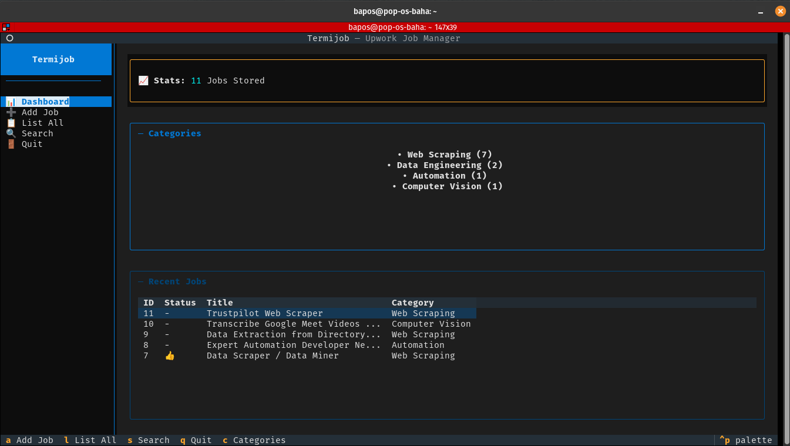
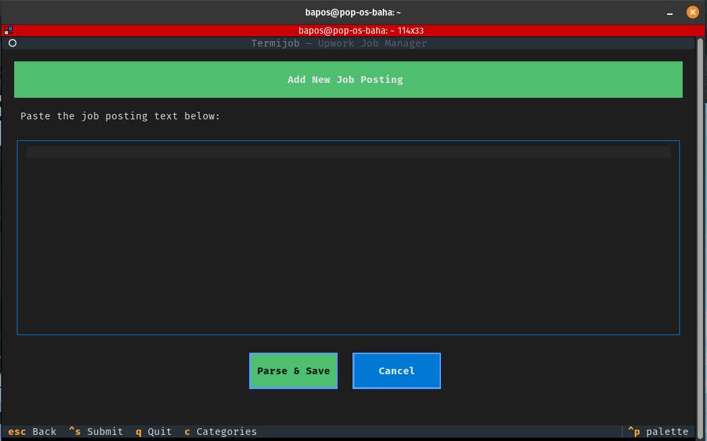
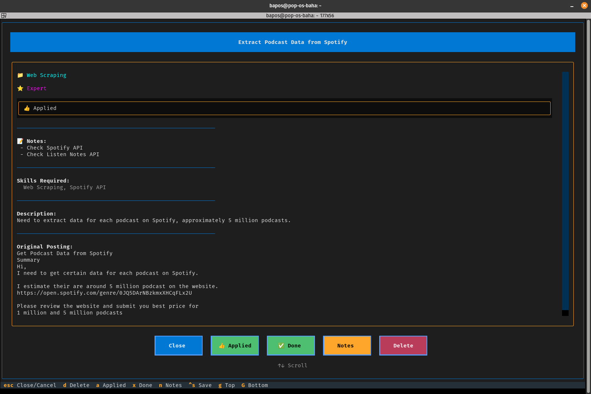
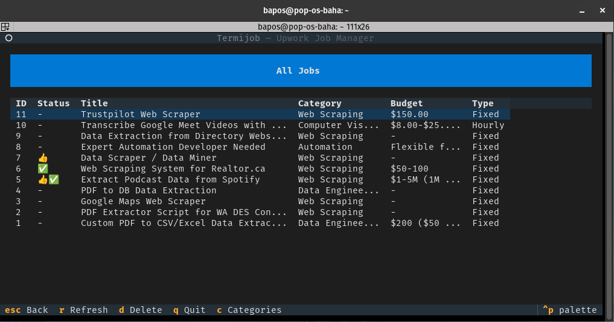

# Termijob

A TUI (Terminal User Interface) application for managing and categorizing Upwork job postings using a local Llama 3.1 LLM.


## Features

- 📊 **Dashboard Layout**: Split-pane interface with sidebar navigation and main content area
- 📋 **Add Jobs**: Paste raw job posting text and automatically parse/categorize using local LLM
- 🏷️ **Smart Categorization**: Jobs are classified into categories like Web Scraping, Machine Learning, Computer Vision, etc.
- 📂 **List Jobs**: View all jobs or filter by category
- 🔍 **Search**: Search jobs by title, description, or skills
- 🗑️ **Delete Jobs**: Remove jobs you're no longer interested in
- 🔒 **Local LLM**: Uses Ollama with Llama 3.1 8B for privacy-focused local processing

## Screenshots

<table>
  <tr>
    <td width="50%">
      <b>Dashboard</b><br/>
      
    </td>
    <td width="50%">
      <b>Add Job</b><br/>
      
    </td>
  </tr>
  <tr>
    <td width="50%">
      <b>Job List</b><br/>
      
    </td>
    <td width="50%">
      <b>Job Details</b><br/>
      
    </td>
  </tr>
</table>

## Prerequisites

1. **Ollama** installed and running:
   ```bash
   # Install Ollama (https://ollama.ai)
   curl -fsSL https://ollama.ai/install.sh | sh
   
   # Start Ollama service
   ollama serve
   
   # Pull the Llama 3.1 model
   ollama pull llama3.1
   ```

2. **Python 3.10+**

3. **uv** (recommended) or pip

## Installation

```bash
# Clone the repository
git clone https://github.com/yourusername/termijob.git
cd termijob

# Install with uv (recommended)
uv sync

# Run the app
uv run termijob
```

Or run directly:
```bash
uv run python -m termijob.app
```

### Alternative: pip installation
```bash
pip install -e .
termijob
```

## Usage

### Adding a Job

1. Press `A` to open the Add Job screen
2. Paste the full job posting text from Upwork
3. Press `Ctrl+S` or click "Parse & Save"
4. The LLM will automatically extract:
   - Job title
   - Category
   - Required skills
   - Budget information
   - Experience level
   - Job type (Fixed/Hourly)

### Keyboard Shortcuts

| Screen | Key | Action |
|--------|-----|--------|
| **Dashboard** | `a` | Add new job |
| | `l` | List all jobs |
| | `s` | Search jobs |
| | `↓` | Navigate menu down |
| | `↑` | Navigate menu up |
| | `Enter` | Select menu item |
| | `q` | Quit |
| **Job List** | `↑/↓` | Navigate |
| | `Enter` | View job details |
| | `d` | Delete selected job |
| | `r` | Refresh |
| | `Esc` | Go back |
| **Add Job** | `Ctrl+S` | Parse and save |
| | `Esc` | Cancel |
| **Job Detail** | `↑/↓` | Scroll content |
| | `g` | Scroll to top |
| | `G` | Scroll to bottom |
| | `d` | Delete job |
| | `Esc` | Close |

## Categories

Jobs are automatically categorized into:

| Category | Description |
|----------|-------------|
| Web Scraping | Data extraction, crawling |
| Computer Vision | Image processing, OCR |
| Machine Learning | ML models, training |
| Data Science | Analysis, visualization |
| Web Development | Frontend, backend, fullstack |
| Mobile Development | iOS, Android apps |
| API Development | REST, GraphQL APIs |
| Automation | Scripts, bots, workflows |
| Natural Language Processing | NLP, text analysis |
| Data Engineering | ETL, pipelines |
| DevOps | CI/CD, infrastructure |
| Database | SQL, NoSQL, design |
| Desktop Application | GUI apps |
| Bot Development | Chatbots, trading bots |
| Other | Uncategorized |

## Configuration

### Changing the LLM Model

Edit `termijob/llm.py` to change the model:

```python
class LLMParser:
    def __init__(self, model: str = "llama3.1"):
        # Change default model here
```

### Data Storage

Jobs are stored in a SQLite database at:
- **Linux**: `~/.local/share/termijob/jobs.db`

## Tech Stack

- **TUI Framework**: [Textual](https://textual.textualize.io/)
- **LLM**: [Ollama](https://ollama.ai/) with Llama 3.1
- **Database**: SQLite with SQLAlchemy
- **Validation**: Pydantic

## License

MIT
